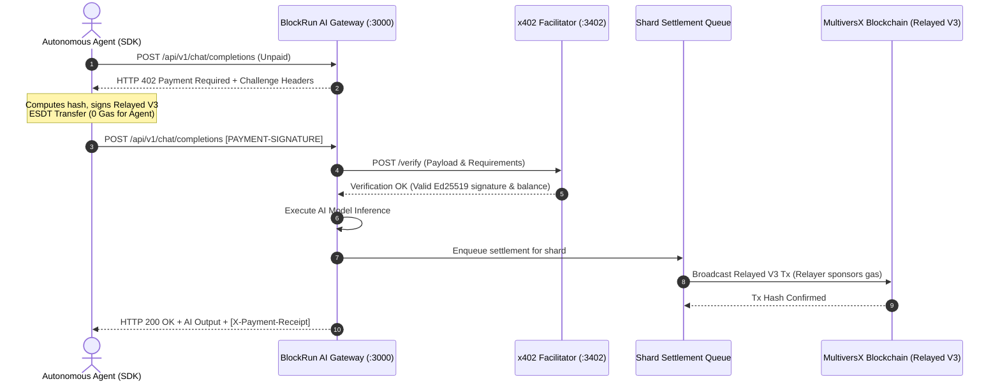

# BlockRun MultiversX Gateway & x402 Facilitator

[](LICENSE)
[](https://multiversx.com)
[](https://x402.org)
[](https://www.typescriptlang.org/)

Autonomous HTTP 402 Payment Gateway and Facilitator infrastructure for AI models and autonomous agents powered by **MultiversX** high-throughput blockchain and **Relayed V3** gasless micropayments.

---

## Table of Contents

- [Overview](#overview)
- [Why MultiversX for Agentic Micropayments](#why-multiversx-for-agentic-micropayments)
- [Architecture & Flow](#architecture--flow)
- [Key Features](#key-features)
- [Quickstart Guide](#quickstart-guide)
  - [TypeScript Agent SDK](#typescript-agent-sdk)
  - [Python Agent Example](#python-agent-example)
- [BlockRun AI Gateway API Reference](#blockrun-ai-gateway-api-reference)
  - [POST /api/v1/chat/completions](#post-apiv1chatcompletions)
  - [POST /api/v1/messages](#post-apiv1messages)
  - [GET /api/v1/models](#get-apiv1models)
  - [GET /health](#get-health)
- [x402 Facilitator API Reference](#x402-facilitator-api-reference)
  - [POST /verify](#post-verify)
  - [POST /settle](#post-settle)
  - [GET /supported](#get-supported)
  - [GET /.well-known/x402](#get-well-knownx402)
  - [GET /openapi.json](#get-openapijson)
- [Multi-Shard Relayer Pool](#multi-shard-relayer-pool)
- [Configuration & Environment Variables](#configuration--environment-variables)
- [Development & Testing](#development--testing)
- [License](#license)

---

## Overview

Autonomous AI agents require sub-cent micropayments per inference call without human-in-the-loop approvals, credit card subscriptions, or API keys. **BlockRun MultiversX Gateway** enables pay-per-token and pay-per-request monetization using standard `HTTP 402 Payment Required` challenges and `Relayed V3` gasless ESDT transactions on MultiversX.

### Key Capabilities
- **Zero Gas for Agents**: Agents only sign the payload transferring USDC; relayer nodes in each shard sponsor the network execution gas.
- **Micro-Cent Pricing**: Precision token unit calculations down to $0.000001 (1 micro-USDC).
- **Dual API Compatibility**: Drop-in proxy replacement for OpenAI (`/api/v1/chat/completions`) and Anthropic (`/api/v1/messages`).
- **Smart Model Routing**: Autonomous heuristic routing (`smartChat`) optimizing cost savings (up to 94%) between eco and premium models.
- **Complete x402 v2 Facilitator**: Fully compliant verification, settlement, and relayer discovery engine.

---

## Why MultiversX for Agentic Micropayments

| Feature | MultiversX | Traditional EVM Networks | Solana / Layer 2s |
| :--- | :--- | :--- | :--- |
| **Throughput & Scalability** | **15,000 - 30,000+ TPS** with State Sharding | 15 - 100 TPS | Variable with congestion |
| **Finality Time** | **Deterministic ~6s (2 rounds)** | Probabilistic (12s - 15m) | 400ms - 12s |
| **Gasless Micropayments** | **Native Relayed V3** (No smart contract wrapper) | ERC-4337 / Meta-tx wrappers | Custom relayer smart contracts |
| **Asset Standard** | **Native ESDT** (First-class citizen, zero contract overhead) | ERC-20 Smart Contracts | SPL Tokens |
| **Multi-Shard Relaying** | **Automatic Shard-Indexed Relayer Pool** | Single monolithic chain | Single shard / rollup |
| **Transaction Fees** | **<$0.002 per tx** | $0.20 - $25.00+ | $0.001 - $0.05 |

---

## Architecture & Flow



---

## Key Features

1. **Relayed V3 Gasless Protocol**:
   - Agent signs only the ESDT transfer.
   - Relayer sponsors the transaction execution gas.
   - Zero native EGLD required in the agent's wallet.
2. **Multi-Shard Concurrency Queue**:
   - Dedicated worker queue per shard (Shard 0, Shard 1, Shard 2, Metachain).
   - Strict relayer nonce serialization preventing race conditions.
   - Exponential backoff retry with transient error handling.
3. **Pluggable Settlement Storage**:
   - `SqliteSettlementStorage` with WAL mode for persistent, thread-safe records.
   - `MemorySettlementStorage` for high-speed ephemeral execution and testing.
4. **Agent Spend Safeguards**:
   - `maxCostPerCall`: Enforces strict maximum budget on single requests.
   - `maxSessionCost`: Limits aggregate session expenditures.

---

## Quickstart Guide

### TypeScript Agent SDK

Install dependencies and start interacting with AI models autonomously:

```typescript
import { setupAgentWallet } from "blockrun-multiversx-gateway";

// 1. Initialize Autonomous Agent Client
const agent = setupAgentWallet({
  mnemonic: process.env.AGENT_MNEMONIC, // Or auto-generates ephemeral wallet
  gatewayUrl: "http://localhost:3000",
  network: "multiversx:1",
  maxCostPerCall: 0.05,     // Max $0.05 per inference call
  maxSessionCost: 1.00,     // Max $1.00 total session budget
});

console.log("Agent MultiversX Address:", agent.getWalletAddress());

// 2. Autonomous OpenAI-compatible Chat Inference
const response = await agent.chat("openai/gpt-5.4", [
  { role: "system", content: "You are an autonomous payments specialist." },
  { role: "user", content: "Explain MultiversX Relayed V3 transactions in 2 sentences." }
]);

console.log("AI Response:", response.choices[0].message.content);
console.log("MultiversX Settlement Tx Hash:", response.paymentReceipt);
console.log("Total Session Spend (USD):", `$${agent.getSessionSpend().toFixed(6)}`);

// 3. Intelligent Smart Chat Routing (Auto Eco vs Premium)
const smartResponse = await agent.smartChat(
  "Summarize token economics for ESDT micropayments",
  "auto" // Routes to eco or premium based on prompt complexity
);

console.log("Selected Model:", smartResponse.routing.model);
console.log("Estimated Cost Savings:", smartResponse.routing.savings);
```

---

### Python Agent Example

```python
import base64
import json
import requests
from multiversx_sdk_core import Address, Transaction, TransactionComputer
from multiversx_sdk_wallet import UserSigner, Mnemonic

# 1. Setup Signer & Address
mnemonic = Mnemonic.from_string("your twenty four words mnemonic ...")
signer = UserSigner(mnemonic.derive_key(0))
agent_address = signer.get_pubkey().to_address()

GATEWAY_URL = "http://localhost:3000"

# 2. Initial Unpaid Request
req_body = {
    "model": "openai/gpt-5.4",
    "messages": [{"role": "user", "content": "Hello autonomous agent world!"}]
}
res = requests.post(f"{GATEWAY_URL}/api/v1/chat/completions", json=req_body)

if res.status_code == 402:
    # 3. Decode x402 Challenge
    raw_header = res.headers.get("PAYMENT-REQUIRED")
    challenge = json.loads(base64.b64decode(raw_header).decode("utf-8"))
    requirement = challenge["accepts"][0]

    # 4. Resolve Relayer Address for Shard
    relayer_res = requests.get(f"{GATEWAY_URL}/relayer/address/{agent_address.bech32()}")
    relayer_address = relayer_res.json()["relayerAddress"]

    # 5. Build Relayed V3 ESDT Transfer Data: ESDTTransfer@<token_hex>@<amount_hex>
    asset_hex = requirement["asset"].encode("utf-8").hex()
    amount_hex = hex(int(requirement["amount"]))[2:]
    if len(amount_hex) % 2 != 0:
        amount_hex = "0" + amount_hex
    tx_data = f"ESDTTransfer@{asset_hex}@{amount_hex}"

    # 6. Construct & Sign Relayed V3 Transaction
    tx = Transaction(
        nonce=1,
        sender=agent_address.bech32(),
        receiver=requirement["payTo"],
        value=0,
        gas_limit=500000,
        gas_price=1000000000,
        data=tx_data.encode("utf-8"),
        chain_id="1",
        version=2,
        options=0,
        relayer=relayer_address,
    )

    tc = TransactionComputer()
    bytes_to_sign = tc.compute_bytes_for_signing(tx)
    sig_hex = signer.sign(bytes_to_sign).hex()

    # 7. Construct PAYMENT-SIGNATURE Header
    payment_payload = {
        "x402Version": 2,
        "resource": {"url": f"{GATEWAY_URL}/api/v1/chat/completions"},
        "accepted": requirement,
        "payload": {
            "nonce": 1,
            "value": "0",
            "receiver": requirement["payTo"],
            "sender": agent_address.bech32(),
            "gasPrice": 1000000000,
            "gasLimit": 500000,
            "data": tx_data,
            "chainID": "1",
            "version": 2,
            "options": 0,
            "signature": sig_hex,
            "relayer": relayer_address,
        }
    }
    encoded_sig = base64.b64encode(json.dumps(payment_payload).encode()).decode()

    # 8. Retry with Payment Signature
    paid_res = requests.post(
        f"{GATEWAY_URL}/api/v1/chat/completions",
        json=req_body,
        headers={"PAYMENT-SIGNATURE": encoded_sig}
    )

    print("Status:", paid_res.status_code)
    print("AI Response:", paid_res.json())
    print("Settlement Tx Receipt:", paid_res.headers.get("x-payment-receipt"))
```

---

## BlockRun AI Gateway API Reference

### `POST /api/v1/chat/completions`
OpenAI-compatible chat completions endpoint with x402 payment enforcement.

**Request Headers:**
- `Content-Type: application/json`
- `PAYMENT-SIGNATURE`: Base64 encoded JSON payment payload (required for paid retry).

**Request Body:**
```json
{
  "model": "openai/gpt-5.4",
  "messages": [
    { "role": "system", "content": "You are a helpful assistant." },
    { "role": "user", "content": "Hello!" }
  ],
  "max_tokens": 1000,
  "temperature": 0.7
}
```

**Challenge Response (`402 Payment Required`):**
```json
{
  "x402Version": 2,
  "accepts": [
    {
      "scheme": "exact",
      "network": "multiversx:1",
      "amount": "100025",
      "asset": "USDC-c76f1f",
      "payTo": "erd1qqqqqqqqqqqqqqqqqqqqqqqqqqqqqqqqqqqqqqqqqqqqqqqqqqqq6gq4hu",
      "maxTimeoutSeconds": 300,
      "extra": {
        "name": "USD Coin",
        "decimals": 6
      }
    }
  ],
  "error": "Payment Required",
  "message": "This endpoint requires x402 payment",
  "price": {
    "amount": "0.100025",
    "currency": "USD"
  }
}
```

---

### `POST /api/v1/messages`
Anthropic-compatible messages endpoint with x402 payment enforcement.

**Request Body:**
```json
{
  "model": "anthropic/claude-sonnet-4.6",
  "messages": [
    { "role": "user", "content": "Analyze MultiversX consensus mechanism" }
  ],
  "max_tokens": 1500
}
```

---

### `GET /api/v1/models`
Lists available AI models, context windows, and per-token pricing.

**Response:**
```json
{
  "object": "list",
  "data": [
    {
      "id": "openai/gpt-5.4",
      "object": "model",
      "owned_by": "openai",
      "context_length": 128000,
      "pricing": {
        "input_per_million": 2.5,
        "output_per_million": 15.0,
        "input_per_token": 0.0000025,
        "output_per_token": 0.000015,
        "currency": "USD"
      }
    },
    {
      "id": "deepseek/deepseek-chat",
      "object": "model",
      "owned_by": "deepseek",
      "context_length": 64000,
      "pricing": {
        "input_per_million": 0.14,
        "output_per_million": 0.28,
        "input_per_token": 0.00000014,
        "output_per_token": 0.00000028,
        "currency": "USD"
      }
    }
  ]
}
```

---

### `GET /health`
Returns gateway health status, loaded model count, merchant pay-to address, and shard queue statistics.

---

## x402 Facilitator API Reference

### `POST /verify`
Verifies an x402 payment signature without executing or broadcasting to the blockchain.

**Request Body:**
```json
{
  "x402Version": 2,
  "paymentPayload": { ... },
  "paymentRequirements": { ... }
}
```

**Response (`200 OK`):**
```json
{
  "isValid": true,
  "paymentPayload": { ... }
}
```

---

### `POST /settle`
Verifies and settles an x402 payment payload by broadcasting the Relayed V3 transaction via the appropriate shard relayer.

**Response (`200 OK`):**
```json
{
  "success": true,
  "transaction": "a69f2e31e9c70b892b1cf56b8259203e4d92994c6530a6c6e7a25f190e8f0814",
  "network": "multiversx:1"
}
```

---

### `GET /supported`
Returns supported payment networks, schemes, tokens, and x402 specification versions.

---

### `GET /.well-known/x402`
Public discovery endpoint describing the Facilitator's capabilities, networks, and endpoints.

---

### `GET /openapi.json`
Complete OpenAPI 3.1.0 specification document for all Facilitator and Gateway endpoints.

---

## Multi-Shard Relayer Pool

MultiversX utilizes adaptive state sharding (Shard 0, Shard 1, Shard 2, Metachain). To achieve zero-conflict gasless relaying:
1. The `RelayerPoolManager` discovers or configures relayer addresses across each shard.
2. The agent's address determines its shard ID via `AddressComputer.getShardOfAddress()`.
3. The Relayed V3 transaction is signed using the relayer corresponding to the agent's shard.
4. Concurrency mutexes per shard prevent nonce collisions and mempool eviction.

---

## Configuration & Environment Variables

| Variable | Description | Default |
| :--- | :--- | :--- |
| `PORT` / `GATEWAY_PORT` | Port for BlockRun AI Gateway HTTP service | `3000` |
| `FACILITATOR_PORT` | Port for x402 Facilitator HTTP service | `3402` |
| `MULTIVERSX_NETWORK` | MultiversX network identifier (`multiversx:1`, `multiversx:D`, `multiversx:T`) | `multiversx:1` |
| `MULTIVERSX_API_URL` | MultiversX REST API URL | `https://api.multiversx.com` |
| `RELAYER_MNEMONIC` | 24-word mnemonic phrase for relayer wallet pool | *(Auto-generated if omitted)* |
| `RELAYER_PEM` | PEM string containing relayer private keys | *Optional* |
| `RELAYER_PEM_PATH` | File path to relayer PEM file | *Optional* |
| `MERCHANT_PAY_TO` | MultiversX bech32 address to receive ESDT payments | *(Relayer address)* |
| `USDC_TOKEN_IDENTIFIER` | MultiversX USDC ESDT token identifier | `USDC-c76f1f` |
| `SQLITE_DB_PATH` | SQLite settlement database path (`:memory:` for in-memory) | `:memory:` |
| `RATE_LIMIT_ENABLED` | Toggle IP-based rate limiting | `true` |

---

## Development & Testing

```bash
# 1. Install dependencies
npm install

# 2. Run TypeScript build
npm run build

# 3. Run full test suite (172 unit, integration & E2E tests)
npm test

# 4. Start local Gateway & Facilitator server
npm run start

# 5. Start development mode with hot reloading
npm run dev
```

---

## License

This project is licensed under the [MIT License](LICENSE).
